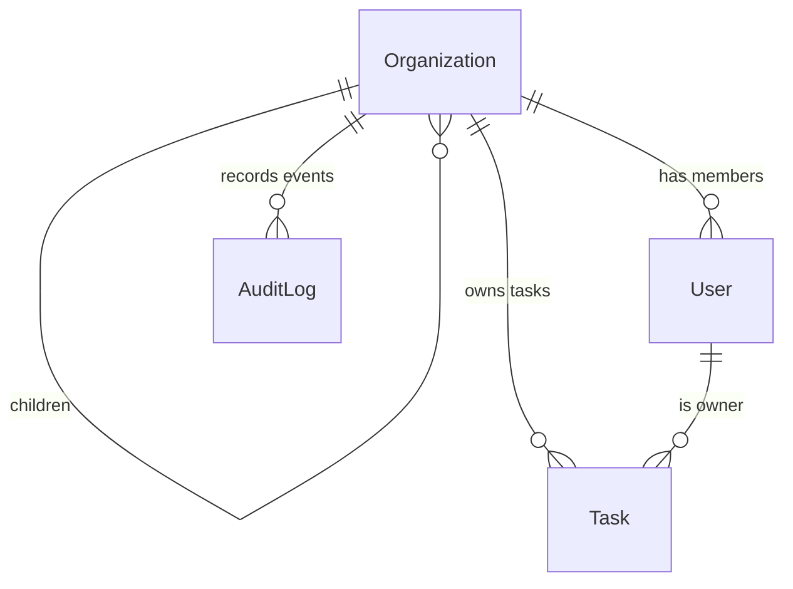

[README.md](https://github.com/user-attachments/files/24520876/README.md)
# Org Task Command Center (Nx + NestJS + Angular)

A full-stack Nx workspace that delivers an organization-aware task board. The NestJS API enforces JWT-based RBAC with audit logging, while the Angular dashboard provides drag-and-drop task management, filtering, completion insights, and keyboard shortcuts.

---

## Setup Instructions

### 1. Prerequisites
- Node.js 18+ (tested with 20.11)
- npm 9+, git, and SQLite (bundled with Node; no separate server is required)
- Recommended: VS Code with the Nx Console extension

### 2. Install dependencies
```bash
npm install
```

### 3. Environment variables (`.env`)
Create an `.env` file in the repo root (or any path you prefer) and populate it with the variables the API reads via `process.env`:

```bash
# .env
JWT_SECRET=dev_super_secret_key
SEED_USER_PASSWORD=Passw0rd!
DATABASE_FILE=./data.sqlite
```

Load the file before running Nx commands. Two portable options:

- **macOS/Linux**: `NODE_OPTIONS="--env-file=.env" npx nx serve api`
- **Windows PowerShell**:
  ```powershell
  $env:NODE_OPTIONS="--env-file=.env"
  npx nx serve api
  ```

> `JWT_SECRET` secures issued tokens, `SEED_USER_PASSWORD` controls the auto-seeded demo accounts, and `DATABASE_FILE` overrides the default SQLite location used in [apps/api/src/app/db/typeorm.config.ts](apps/api/src/app/db/typeorm.config.ts#L3-L18).

### 4. Run the backend (NestJS API)
```bash
# Terminal 1
NODE_OPTIONS="--env-file=.env" npx nx serve api
```
- Serves on `http://localhost:3000`
- Seeds three users (owner/admin/viewer) exactly once when the database is empty via [apps/api/src/app/seed/seed.service.ts](apps/api/src/app/seed/seed.service.ts#L7-L54)
- Hot reloads when server files change

**Default seed accounts**

| Role | Email | Password |
| --- | --- | --- |
| owner | owner@example.com | `Passw0rd!` (or `SEED_USER_PASSWORD`) |
| admin | admin@example.com | `Passw0rd!` |
| viewer | viewer@example.com | `Passw0rd!` |

### 5. Run the dashboard (Angular)
```bash
# Terminal 2
npx nx serve dashboard --proxy-config apps/dashboard/proxy.conf.json
```
- Serves on `http://localhost:4200`
- Proxy config forwards `/api` requests to the backend so the Angular `HttpClient` can call relative paths (see [apps/dashboard/src/app/tasks/tasks.service.ts](apps/dashboard/src/app/tasks/tasks.service.ts#L1-L33))

### 6. Optional quality checks
```bash
npx nx run-many -t lint,test --projects=api,dashboard
```

---

## Architecture Overview

| Scope | Path | Notes |
| --- | --- | --- |
| API app | [apps/api](apps/api) | NestJS monolith exposing authentication, tasks, and audit log endpoints. Modules: `AuthModule`, `TasksModule`, `AuditLogModule`, and infrastructure helpers (TypeORM config, seed service). |
| Dashboard app | [apps/dashboard](apps/dashboard) | Angular standalone app with CDK drag-drop, reactive forms, and signals. Auth + tasks features live under `src/app`. |
| Shared auth lib | [libs/auth](libs/auth) | Provides `JwtAuthGuard`, `JwtStrategy`, `RolesGuard`, decorators, and audit helpers so API modules share the same RBAC primitives. |
| Shared data lib | [libs/data](libs/data) | TypeORM entities (Organization, User, Task, AuditLog) plus exported types reused on both API and shared tooling. |

**Why NX?**
- A single dependency graph lets us share guards/entities without duplicating code.
- `run-many`, affected command graph, and caching make it easy to test API and UI together.
- Each app keeps its own tsconfig/project.json while still sharing lint/test presets.

---

## Data Model Explanation

| Entity | Definition | Highlights |
| --- | --- | --- |
| Organization | [libs/data/src/lib/entities/organization.entity.ts](libs/data/src/lib/entities/organization.entity.ts#L1-L17) | Supports parent/child relationships for future multi-tenant hierarchies. |
| User | [libs/data/src/lib/entities/user.entity.ts](libs/data/src/lib/entities/user.entity.ts#L1-L24) | Stores `email`, `passwordHash`, `role` (`owner` > `admin` > `viewer`), and the owning organization (eagerly loaded). |
| Task | [libs/data/src/lib/entities/task.entity.ts](libs/data/src/lib/entities/task.entity.ts#L1-L43) | Tracks status (`todo`, `in-progress`, `done`), category, swimlane position, owner, organization, plus timestamps for board sorting. |
| AuditLog | [libs/data/src/lib/entities/audit-log.entity.ts](libs/data/src/lib/entities/audit-log.entity.ts#L1-L30) | Persists allow/deny actions, reasons, and arbitrary JSON `details` for forensics. |



- Every user belongs to exactly one organization; `Organization.parent` enables delegation trees later.
- Tasks enforce organization alignment on creation and updates (see [apps/api/src/app/tasks/tasks.service.ts](apps/api/src/app/tasks/tasks.service.ts#L17-L193)).
- Audit entries are created for both allow and deny decisions so suspicious attempts are captured even when blocked.

---

## Access Control Implementation

### Role hierarchy & permissions
- Roles live on the user entity and are compared via `hasRoleOrHigher` in [libs/auth/src/lib/role.utils.ts](libs/auth/src/lib/role.utils.ts#L1-L32). The ascending order is `viewer < admin < owner`.
- `RolesGuard` ([libs/auth/src/lib/roles.guard.ts](libs/auth/src/lib/roles.guard.ts#L1-L49)) reads `@Roles(...)` metadata and denies requests when the caller’s role rank is below the requirement. Decisions are logged via [libs/auth/src/lib/audit-logger.service.ts](libs/auth/src/lib/audit-logger.service.ts#L1-L41).
- Task mutations include organization and ownership checks (`isSameOrganization`, `isResourceOwner`) so even admins cannot cross tenant boundaries.

### JWT authentication flow
1. `POST /auth/login` ([apps/api/src/app/auth/auth.controller.ts](apps/api/src/app/auth/auth.controller.ts#L6-L22)) validates credentials against hashed passwords via [AuthService](apps/api/src/app/auth/auth.service.ts#L10-L39).
2. Upon success, the API issues a signed JWT describing `sub`, `email`, `role`, and `orgId`. The signing and validation logic resides in [libs/auth/src/lib/jwt.strategy.ts](libs/auth/src/lib/jwt.strategy.ts#L1-L34).
3. The Angular client saves the token in localStorage through [apps/dashboard/src/app/auth/token-storage.service.ts](apps/dashboard/src/app/auth/token-storage.service.ts#L3-L22) and attaches it with the [HTTP interceptor](apps/dashboard/src/app/auth/auth.interceptor.ts#L1-L20).
4. Protected routes require `JwtAuthGuard` plus `RolesGuard`, guaranteeing both authentication and authorization checks before hitting business logic.

---

## API Docs

Base URL: `http://localhost:3000`
Authentication: `Authorization: Bearer <token>` for every route except `POST /auth/login`.

### Auth

| Method | Path | Description |
| --- | --- | --- |
| POST | `/auth/login` | Exchange email/password for a JWT. |
| GET | `/auth/me` | Returns the caller profile extracted from the JWT. |

**Sample**
```bash
curl -X POST http://localhost:3000/auth/login \
  -H "Content-Type: application/json" \
  -d '{"email":"owner@example.com","password":"Passw0rd!"}'
```
Response
```json
{ "access_token": "eyJhbGciOiJIUzI1NiIsInR5cCI6IkpXVCJ9..." }
```

### Tasks

| Method | Path | Roles | Notes |
| --- | --- | --- | --- |
| GET | `/tasks` | viewer+ | Returns tasks scoped to the caller’s organization (viewers only see their own). |
| POST | `/tasks` | admin+ | Creates a task; auto-assigns swimlane position. |
| PUT | `/tasks/:id` | admin+ | Updates title, description, status, category, owner, or position. |
| DELETE | `/tasks/:id` | admin+ | Removes a task and logs the deletion. |
| POST | `/tasks/reorder` | admin+ | Bulk reorder of a swimlane by sending `{ "status": "in-progress", "taskIds": [3,1,4] }`. |

Example response for `GET /tasks`:
```json
[
  {
    "id": 12,
    "title": "Draft Q1 report",
    "status": "in-progress",
    "category": "Work",
    "position": 1,
    "owner": { "id": 2, "email": "admin@example.com" },
    "organization": { "id": 1, "name": "Seed Organization" }
  }
]
```

### Audit Log

| Method | Path | Roles | Description |
| --- | --- | --- | --- |
| GET | `/audit-log` | admin+ | Returns the 100 most recent audit entries for the caller’s organization. Each entry includes `action`, `status (ALLOW/DENY)`, `reason`, and timestamps. |

---

## Future Considerations

1. **Advanced role delegation** – Extend the Organization hierarchy so owners can grant scoped permissions (e.g., project-level managers) and inherit policies down the tree.
2. **Production-ready security hardening** – Add refresh tokens + rotation, CSRF/PKCE for SPAs, configurable password policies, secret management (Key Vault/Azure App Config), and caching for RBAC lookups to remove repeated database hits.
3. **Efficient permission evaluation at scale** – Introduce memoized policy engines or attribute-based access control (ABAC) so bulk operations (like large task reorders) can authorize thousands of records without per-row SQL checks.

---

## Appendix
- Seeded credentials live in the table at the top of this document; override the password via `SEED_USER_PASSWORD`.
- Update TypeORM to a production-ready database (PostgreSQL/Azure Cosmos DB with PostgreSQL wire protocol, etc.) by editing [apps/api/src/app/db/typeorm.config.ts](apps/api/src/app/db/typeorm.config.ts#L3-L18).
- Review audit output via `nx serve api` logs or by querying `/audit-log` as an owner/admin.# New Nx Repository

